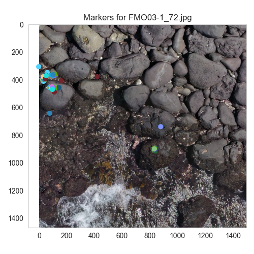

# iguanas-from-above-zooniverse
Process to cluster marks set by Volunteers on zooniverse

## Installation
Python 3.8, 3.9, 3.10 are tested. To install the required packages, run the following command:
```bash
pip install -r requirements.txt
```

If the install doesn't work, try to install the packages one by one:
```bash
pip install matplotlib jupyterlab pandas scikit-learn loguru black  
```

## Usage
The Notebooks [Zooniverse_Clustering](./Zooniverse_Clustering.ipynb) illustrates the process to cluster the marks set by volunteers on zooniverse. 
Run jupyterlab first via 
```bash
jupyter lab
```
It requires some files defined in the config.py file

```python
from pathlib import Path

def get_config(phase_tag, input_path, output_path=None):
    configs = {}
    if output_path is None:
        output_path = input / Path("current_analysis").joinpath(phase_tag)
    configs["Iguanas 1st launch"] = {
        # classifications downloaded from zooniverse
        "annotations_source": input_path.joinpath("IguanasFromAbove/2023-10-15/iguanas-from-above-classifications.csv"),
    
        # gold standard datatable with the expert count, used for filtering the dataset
        "goldstandard_data": input_path / Path(
            "Images/Zooniverse_Goldstandard_images/expert-GS-1stphase.csv"),
    
        # which images/subject ids to consider. filters the data.
        "gold_standard_image_subset":
            input_path.joinpath("Images/Zooniverse_Goldstandard_images/1-T2-GS-results-5th-0s.csv"),
    
        # images for plot on them
        "image_source": input_path.joinpath("Images/Zooniverse_Goldstandard_images/1st launch"),
    
        }

```

While "annotations_source" is the zooniverse classification export, goldstandard_data and gold_standard_image_subset are used for filtering need to contain the subject_id of the images.

1-T2-GS-results-5th-0s.csv

| subject_id | Median0s | Mean0s | Max0s | Std0s | Median.r | Mean.r | Mode0s|
|------------| --- | --- | --- | --- | --- | --- | --- | 
| 47967876   | 1 | 1.444444444 | 3 | 0.726483157 | 1 | 1 | 1|
| 47967959   | 1 | 1.181818182 | 2 | 0.404519917 | 1 | 1 | 1|
| 47967961   | 9 | 9 | 12 | 2.581988897 | 9 | 9 | 12|

expert-GS-1stphase.csv

| subspecies         | island   | site_name | subject_group | image_name             | subject_id | presence_absence | count_male-lek | count_male-no-lek | count_others | count_partial | count_total | quality | condition | comment                                      |
|--------------------|----------|-----------|---------------|------------------------|------------|------------------|----------------|-------------------|--------------|---------------|-------------|---------|-----------|----------------------------------------------|
| A. c. trillmichi   | Santa Fe | El Miedo  | SFM1          | SFM01-2-2-2_282.jpg    | 47969795   | Y                | 0              | 2                 | 0            | 2             | 2           | Good    | Hard      |                                              |
| A. c. trillmichi   | Santa Fe | El Miedo  | SFM1          | SFM01-2-2-1_344.jpg    | 47969531   | Y                | 0              | 2                 | 2            | 1             | 4           | Good    | Hard      | not consider number 4 marked in the image    |
| A. c. trillmichi   | Santa Fe | El Miedo  | SFM1          | SFM01-2-2-2_270.jpg    | 47969760   | Y                | 0              | 0                 | 0            | 1             | 0           | Good    | Hard      |                                              |


It results in csv files with the clustering results and images with the marks and the clusters. The method_comparison.csv file contains the comparison between the clustering methods per image.

| image_name      | subject_id | count_total | median_count | mean_count | mode_count | users | sum_annotations_count | annotations_count                            | dbscan_count_sil | HDBSCAN_count |
|-----------------|------------|-------------|--------------|------------|------------|-------|-----------------------|----------------------------------------------|------------------|---------------|
| EGI08-2_78.jpg  | 72333835   | 1           | 1.0          | 1.00       | 1          | 12    | 12                    | [1, 1, 1, 1, 1, 1, 1, 1, 1, 1, 1, 1]         | 1                | 1             |
| FMO03-1_65.jpg  | 72338628   | 5           | 4.0          | 3.42       | 4          | 19    | 65                    | [1, 2, 2, 3, 3, 3, 3, 4, 4, 4, 4, 4, 4, 4, 4, ... | 4                | 4             |
| FMO03-1_72.jpg  | 72338635   | 4           | 3.0          | 2.65       | 4          | 20    | 53                    | [1, 1, 1, 1, 2, 2, 2, 2, 2, 3, 3, 3, 3, 3, 4, ... | 3                | 4             |

## Examples
Running the notebook requires setting some variables
```python
from pathlib import Path

input_path =Path("/Users/christian/data/zooniverse")

reprocess = True # if True, the raw classification data is reprocessed. If False, the data is loaded from disk

# Phase Selection
phase_tag = "Iguanas 1st launch"
# phase_tag = "Iguanas 2nd launch"
# phase_tag = "Iguanas 3rd launch"

debug = False # debugging with a smaller dataset
plot_diagrams = False # plot the diagrams to disk for the clustering methods
show_plots = False # show the plots in the notebook
user_threshold = None # in a number, filter records which have less than these user interactions.

```

### Example 1 


### Example 2



